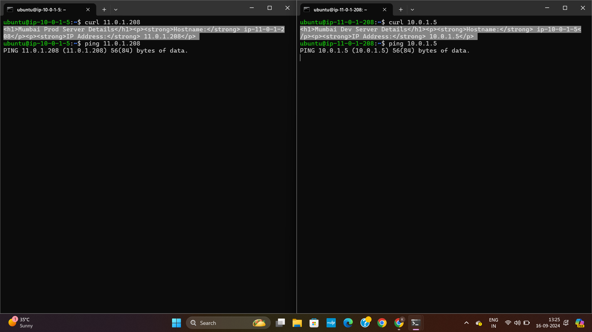

# AWS Transit Gateway Setup with Inter-VPC Communication

.

## Overview
This document explains how to establish inter-VPC communication using AWS Transit Gateway. The architecture includes three VPCs—Dev, Prod, and Test—connected via Transit Gateway attachments. 

## Requirements
1. **AWS Account**  
   - Access to the AWS Management Console.
   
2. **VPC Setup**  
   - Three VPCs: Dev, Prod, and Test.  
   - Each VPC configured with its CIDR range.

3. **Transit Gateway**  
   - AWS Transit Gateway created for centralized routing.

4. **Transit Gateway Attachments**  
   - Attach each VPC (Dev, Prod, and Test) to the Transit Gateway via attachments.

5. **EC2 Instances**  
   - One EC2 instance launched in each VPC.  
   - Instances should have appropriate security group rules to allow traffic between VPCs.

6. **Routing Configuration**  
   - Update route tables in each VPC to route traffic via the Transit Gateway.

7. **Testing Connectivity**  
   - Install `curl` on EC2 instances to test communication between VPCs.

---

## Setup Instructions

1. **Create VPCs**
   - Configure three VPCs: Dev, Prod, and Test with distinct CIDR ranges.
   - Ensure each VPC has subnets for proper routing.

2. **Create Subnets**
   - Create subnets (public and private) for each VPC (Dev, Prod, and Test).
   - Ensure each subnet is within the VPC’s CIDR range.

3. **Create a Transit Gateway**
   - Navigate to **AWS Management Console > VPC > Transit Gateway**.
   - Click on 'Create Transit Gateway' and give it a name.
   - Ensure it is configured for routing and association.

4. **Create Transit Gateway Attachments**
   - Go to 'Transit Gateway Attachments' and click on 'Create Attachment'.
   - Attach each VPC (Dev, Prod, Test) to the Transit Gateway.

5. **Configure Route Tables**
   - In each VPC, update route tables to route traffic destined for other VPCs through the Transit Gateway.
   - Example: In Dev's route table, route Prod and Test CIDR ranges via Transit Gateway.

6. **Launch EC2 Instances**
   - Launch one EC2 instance in each VPC with proper security group settings.
   - Ensure EC2 instances can communicate across VPCs using private IPs.

7. **Update Security Groups**
   - Modify security groups to allow traffic between VPCs by adding inbound rules for necessary protocols.

8. **Test Connectivity**
   - SSH into an EC2 instance in one VPC and use the `curl` or `ping` commands to test communication with EC2 instances in other VPCs.

   Example:
   curl http://<Private_IP_of_EC2_in_Other_VPC>
   ping <Private_IP_of_EC2_in_Other_VPC>

## Final Output:

# Thankyou!
